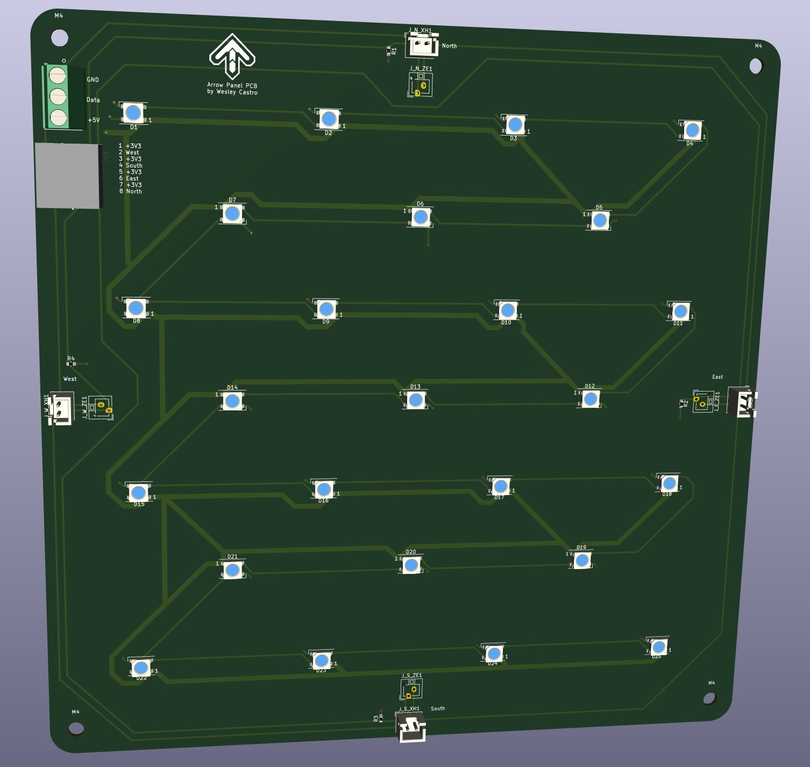
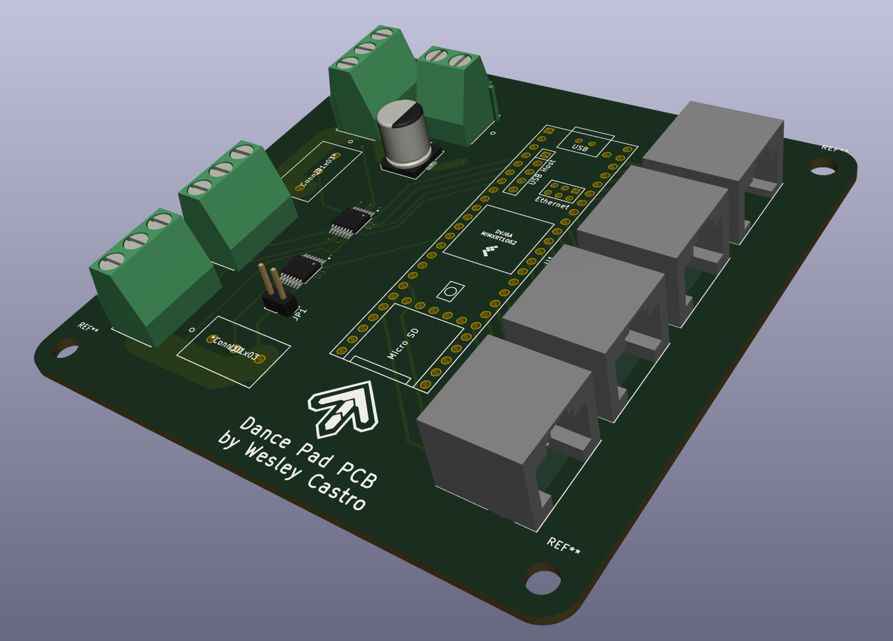

# 8020 Extruded Aluminum Dance Pad

*Stepmania: Way more fun than a Pelaton bike.*

4-panel dance pad project using a frame built out of 30mm profile 8020
("T-Slot") extruded aluminum including a bar with 9 arrow panels following a
similar design to StepManiaX pads. Each directional arrow has a PCB containing
25 WS2812B RGB LEDs and 4 FSR sensors connected to a Main PCB that acts as a
breakout for a Teensy 4.1.

The firmware reads values from 16 sensors and reports them as gamepad inputs.
I'm using homemade sensors created with two 150mm strips of 1/4" copper tape
attached to 160mm x 20mm transparency film with 4mil Velostat placed across the
top. Wires are soldered to each of the copper tape strips and terminate to
JST-XE connectors at the end to connect to the Arrow Panel PCB. According to
papers I've read, creating FSR in this way will likely lead to less drifting
over time compared to "sandwich" style sensors where Velostat is placed between two
pieces of copper tape. This is similar to the method used by commercially-produced FSRs.

## Motivation

There has been a ton of interest in using force sensitive resistors in dance
pads recently to replace contact-based sensors and many designs have been
created. I decided to create a design for a full pad that is durable but doesn't
require power tools to build. I also wanted to gain experience using Inventor
and KiCad and share my design with others who may find it useful. It's certainly
not the best design, but the experience I've gained in the progress is
invaluable.

Having a personal projects to come back to is a great and productive way to
increase your creative and technical skills, especially during COVID times. And
if the project involves maintaining your physical health, that's even better! I
can't stress enough how rewarding it is to start a project, work on in over the
course of a few months, and see it through to completion. Soapbox aside, I
highly recommend attempting projects for things that seem slightly out of your
abilities. You might be surprised what you're capable of if you stick with it.

## Planned Features

* Decode SextetStream lighting data to trigger fixed colors
* Trigger lighting within the firmware based on sensor inputs
* Display LED animations from GIFs stored on a MicroSD card connected to the
  Teensy. Trigger these from SextetStream data or sensor triggers

## Directory Structure

* Arrow PCB: 2 layer 200mm x 200mm PCB used within each arrow containing 25
  WS2812B V5 LEDs arranged in an alternating 4,3 grid pattern and pins for 4
  FSRs connected using JST-XH and JST-ZE connectors. Created in KiCad. Each FSR
  uses a 330 ohm pull down resistor to ground. The board is connected to the
  Main PCB using a CAT6 cable for the four sensors and screw terminals for the
  LED power, ground, and data lines. The PCB can be rotated to the best location
  to route wires to the Main PCB by denoting the location in the firmware.
  M4-sized terminals are on the corners of the PCB so it can be mounted to the
  frame using 3D printed parts (TODO).

* Main PCB: Breakout board for a Teensy 4.1. Wires RJ45 connectors for
  connections coming from 4 Arrow PCBs and screw terminals for up 5 LED strands
  interfaced through 3.3V to 5V logic converters. The sensor wires are decoupled
  with 3.3v wires in the cable to minimize interference. Supports JSR-XE (what
  I'm using) and JST-ZH (What StepManiaX uses) for the sensors) connectors for
  each sensor. Has M4-sized screw terminal to attach to 3D printed mounting
  hardware (TODO).

* Configurator: Application to configure and debug the pad written in Python.
  Communicates with the firmware using a serial connection. Will likely use a
  web interface for the frontend and communicate with the backend using
  WebSockets.

* Firmware: Code that runs on the Teensy. Reads sensor values, listens for
  serial messages, and controls the LEDs. Uses fixed timings for sending Joypad
  reports and updating the LEDs. The goal is for it to be easy enough to modify
  to support different pad layouts (i.e. 5 panel StepManiaX or Pump It Up pads)

## Status

The frame, acrylic panels, and PCB designs have been finalized. Arrow panels
were fabricated by TAP Plastics and have been delivered. Parts for the frame
have been ordered (8020 bars, corner brackets, corner plates, T-Slot nuts,
fasteners, and end caps). The mounting hardware for the Arrow Panel PCB and Main
PCB need to be designed and printed.

The arrows have counter bore screws but I made the larger part of the counter
bore too small (It's a 9.53mm counterbore for a 7.94mm through hole, leaving
~0.8mm radius for the counterbore. Whoops.). It's large enough to fit button-head
M5 screws with a 3D printed spacer but M6 socket and button head screws will not
fit unfortunately. These will work fine with M5 screws but the lesson learned is
to not hastily order things like this in the future :-).

Another possible issue I've found is that the pulldown resistors used in the
Arrow PCB (330 ohm) might make the arrows to sensitive. This can be remedied by
removing the resistors (difficult) or soldering additional ones in parallel on
top of them (easier) to create a parallel resistance. I'll need to wait for the
Arrow Panel PCBs to know for sure if this will be an issue.

The Configurator and Firmware components are in progress. MVP is to communicate
with the board over serial and display the raw sensor values in a graph in the
frontend.
